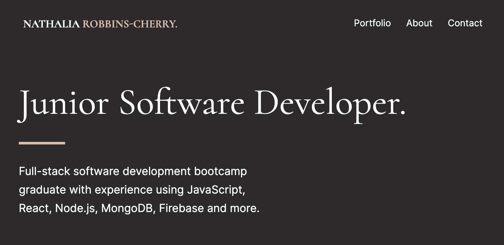
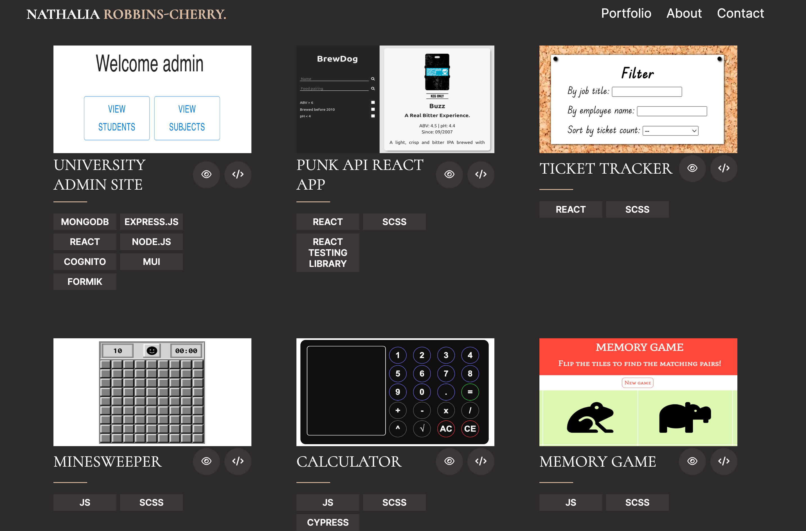
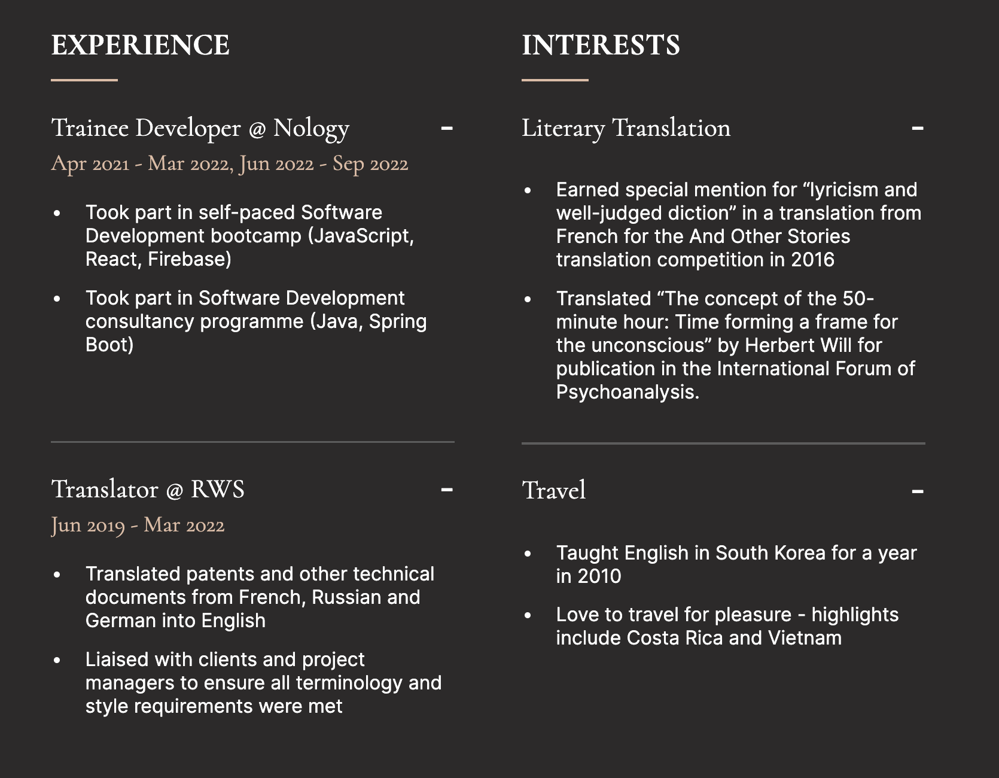

Portfolio page showcasing my projects.

I have used SCSS and BEM throughout the project, as well as tabindex and aria labels to improve accessibility.

The drowpown menu in the navbar in mobile view and the dropdown content in the cv cards have been achieved using a hidden checkbox which changes the height of the relevant div when checked via its associated label.

Screenshots:

